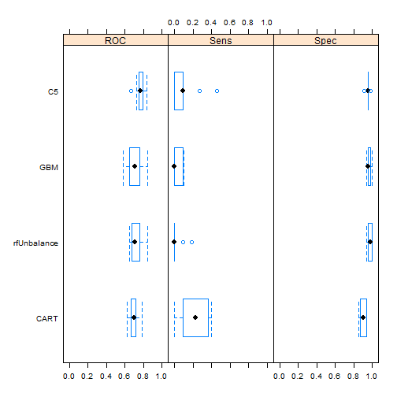

Classification Model
===========================================

##Classification method for predictive modelling

###Basic settings


```r
echo = TRUE
setwd("c:/Users/jasmine.qi/Documents/Classification")
library(Rcmdr)
library(lattice)
library(ggplot2)
library(caret)
library(rpart)
library(party)
library(gmodels)
library(pROC)
library(rattle)
library(randomForest)
library(ROCR)
```
### Descriptive

```r
## Load files which in the Classification folder
total= read.csv("derive.csv")
dim(total)
```

```
## [1] 842 116
```

```r
#Classify datasets to Good Loan and Bad Loan

#Summary of Good loans and Bad loans
local({
  .Table <- with(total, table(Classifier))
  cat("\ncounts:\n")
  print(.Table)
  cat("\npercentages:\n")
  print(round(100*.Table/sum(.Table), 2))
})
```

```
## 
## counts:
## Classifier
##  Bad Good 
##  152  690 
## 
## percentages:
## Classifier
##   Bad  Good 
## 18.05 81.95
```

```r
# Histogram of Loanscores

x=total$Loanscore
h=hist(x, col = "red", breaks = 20, main = "Breaks=20 of mean", xlab=" loan performance scores" )
xfit<-seq(min(x),max(x),length=40) 
yfit<-dnorm(xfit,mean=mean(x),sd=sd(x)) 
yfit <- yfit*diff(h$mids[1:2])*length(x) 
lines(xfit, yfit, col="blue", lwd=2)
```

 

```r
# randomsize 70% of row of data as training set and test set
#set.seed(1)

indexes = sample(1:nrow(total), size= 0.7*nrow(total))
train = total[indexes, ]
test = total[-indexes, ]

nrow(train)
```

```
## [1] 589
```

```r
nrow(test)
```

```
## [1] 253
```

### summary of predictors that model used


```r
formula=Classifier ~ Absorption.Rate...prior.4.6.months. + 
  Absorption.Rate...prior.7.12.months. + 
  Absorption.Rate...prior.current.3.months. + Appraisal.Monthly.Rent + 
  Appraisal.price + Assignment.Type + Bankrupcy + Baths + Bedrooms + 
  Borrower.Age.Group + Borrower.Rent + Built.up + Charge.offs + 
  Closed.Past.Auto.Late + Closed.Past.Education.Late + 
  Closed.Past.Installment.Late + Closed.Past.Mortgage.Late + 
  Closed.Revolving.Late + Collections + Comparable.properties.lower.price + 
  Comparable.properties.upper.price + Comparable.sale.lower.price.range + 
  Comparable.sale.upper.price.range + Condition + Credit.Score + Debt.High.Credit.... + Demand.Supply + 
  distancemiles + DOM + Expected.cost.to.Rehab63 + Expected.flip.price + 
  Foreclosure + Foreclosure.sales + 
  Full.or.Part.Time.investor + Growth + Indicated.Value.by.Cost.Approach + 
  Indicated.Value.by.Income.Approach + Interest.Rate + Lending.Value + 
  Loan.Purpose + Loan.Term + Loan.Type + Location + LTV + Male.Female + 
  Marketing.Time + Median.Comparable.List.Price.prior.4.6.months. + 
  Median.Comparable.List.Price.prior.7.12.months. + 
  Median.Comparable.List.Price.prior.current.3.months. + 
  median.Comparable.listings.Days.on.Market.prior.4.6.months. + 
  median.Comparable.listings.Days.on.Market.prior.7.12.months. + 
  median.Comparable.listings.Days.on.Market.prior.current.3.months. + 
  Median.Comparable.Sale.Price..prior.4.6.months. + 
  Median.Comparable.Sale.Price..prior.7.12.months. + 
  Median.Comparable.Sale.Price..prior.current.3.months. + 
  Median.Comparable.sales.Days.on.market.prior.4.6.months. + 
  Median.Comparable.sales.Days.on.market.prior.7.12.months. + 
  Median.Comparable.sales.Days.on.market.prior.current.3.months. + 
  Median.Sale.Price.a.s..of.List.Price.prior.4.6.months. + 
  Median.Sale.Price.a.s..of.List.Price.prior.7.12.months. + 
  Median.Sale.Price.a.s..of.List.Price.prior.current.3.months. + 
  Months.of.Housing.Supply.prior.4.6.months. + 
  Months.of.Housing.Supply.prior.7.12.months. + 
  Months.of.Housing.Supply.prior.current.3.months. + Occupant + 
  Open.Current.Auto.Late + Open.Current.Education.Late + 
  Open.Current.Installment.Late + Open.Current.Mortgage.Late + 
  Open.Current.Revolving.Late  + Origination.UPB + 
  OrigTransdays + Price.of.Prior.Sale.Transfer+ 
  Property.Values + Rent.Own + Repeat + Rooms + Sale.Price + Size + 
  Square.feet.of.gross.living.area  + 
  Subject..PropertyState + Total...of.Comarable.Sales...prior.4.6.months. + 
  Total...of.Comarable.Sales...prior.7.12.months. + 
  Total...of.Comarable.Sales...prior.current.3.months. + 
  Total...of.Comparable.Active.listings.prior.4.6.months. + 
  Total...of.Comparable.Active.listings.prior.7.12.months. + 
  Total...of.Comparable.Active.listings.prior.current.3.months. + Type + 
  Units + VFS.Internal.Value + WLV + X..of.comarable.properties + 
  X..of.comparable.sales + X..of.home.purchased.in.last.3.years + 
  X..of.Properties.currently.owned + X..of.years.investing +Yearbuilt
```

### A simple tree model-CART 

```r
## A simple tree model

ctrl_rpart=trainControl(method ="cv", number=10, summaryFunction = twoClassSummary, classProbs=TRUE)
train_tree= train(formula, data=train, method="rpart", tuneLength=10, metric="ROC",trControl=ctrl_rpart)

##plot tree of trainig model
fancyRpartPlot(train_tree$finalModel, cex=0.7, main = "Tree of CART Model", sub="")
```

 

```r
plot(varImp(train_tree), top=15, xlab="Variable Imortance for CART Models")
```

 

```r
##Predict test sets
test_pred = predict(train_tree, test)
cart=confusionMatrix(test_pred, test$Classifier)

cart
```

```
## Confusion Matrix and Statistics
## 
##           Reference
## Prediction Bad Good
##       Bad    5   13
##       Good  39  196
##                                           
##                Accuracy : 0.7945          
##                  95% CI : (0.7394, 0.8425)
##     No Information Rate : 0.8261          
##     P-Value [Acc > NIR] : 0.9183633       
##                                           
##                   Kappa : 0.0671          
##  Mcnemar's Test P-Value : 0.0005265       
##                                           
##             Sensitivity : 0.11364         
##             Specificity : 0.93780         
##          Pos Pred Value : 0.27778         
##          Neg Pred Value : 0.83404         
##              Prevalence : 0.17391         
##          Detection Rate : 0.01976         
##    Detection Prevalence : 0.07115         
##       Balanced Accuracy : 0.52572         
##                                           
##        'Positive' Class : Bad             
## 
```

```r
#predict class probabilities
test_predprob = predict(train_tree, test, type="prob")
head(test_predprob)
```

```
##           Bad      Good
## 1  0.08484848 0.9151515
## 4  0.80952381 0.1904762
## 7  0.08484848 0.9151515
## 10 0.16666667 0.8333333
## 11 0.08484848 0.9151515
## 13 0.23076923 0.7692308
```

```r
##plot ROC curve
test_predroc = roc(response=test$Classifier, predictor = test_predprob$Bad, levels = rev(levels(test$Classifier)))
```
### C5 model

```r
##c5
grid = expand.grid(.model="tree",
                   .trials=c(1:100),
                   .winnow=F)
train_treec5 = train(formula,data=train, method="C5.0", metric="ROC", tuneGrid=grid, trControl=ctrl_rpart)


## plot c5 model Tree
plot(train_treec5)
```

 

```r
## predict test datasets and Accurarcy

test_predc5= predict(train_treec5, test)
c5=confusionMatrix(test_predc5, test$Classifier)

c5
```

```
## Confusion Matrix and Statistics
## 
##           Reference
## Prediction Bad Good
##       Bad    8   11
##       Good  36  198
##                                           
##                Accuracy : 0.8142          
##                  95% CI : (0.7607, 0.8602)
##     No Information Rate : 0.8261          
##     P-Value [Acc > NIR] : 0.7232035       
##                                           
##                   Kappa : 0.1665          
##  Mcnemar's Test P-Value : 0.0004639       
##                                           
##             Sensitivity : 0.18182         
##             Specificity : 0.94737         
##          Pos Pred Value : 0.42105         
##          Neg Pred Value : 0.84615         
##              Prevalence : 0.17391         
##          Detection Rate : 0.03162         
##    Detection Prevalence : 0.07510         
##       Balanced Accuracy : 0.56459         
##                                           
##        'Positive' Class : Bad             
## 
```

```r
#Test set ROC Curve

test_predc5prob = predict(train_treec5, test, type = "prob")
head(test_predc5prob)
```

```
##          Bad      Good
## 1  0.2151173 0.7848827
## 4  0.6940600 0.3059400
## 7  0.2911824 0.7088176
## 10 0.2609930 0.7390070
## 11 0.1709247 0.8290753
## 13 0.3590113 0.6409887
```

```r
test_predc5roc = roc(response=test$Classifier, predictor = test_predc5prob$Bad, levels = rev(levels(test$Classifier)))
```


##Random Forest method


```r
#set.seed(1)

#Regardless unbalanced class
train_rf=train(formula, data=train, method="rf", trControl=ctrl_rpart, prox=T, allowParallel=T, metric="ROC")

#Consider unbalanced class - Down sampling Good loans
train_rf2=randomForest(formula, data=train, ntree=train_rf$finalModel$ntree, mtry=train_rf$finalModel$mtry, proximity=T, strata=train$Classifier,sampsize=rep(min(table(train$Classifier)), nlevels(train$Classifier)))


#Unbalanced
train_rf$finalModel
```

```
## 
## Call:
##  randomForest(x = x, y = y, mtry = param$mtry, proximity = ..1,      allowParallel = ..2) 
##                Type of random forest: classification
##                      Number of trees: 500
## No. of variables tried at each split: 76
## 
##         OOB estimate of  error rate: 19.52%
## Confusion matrix:
##      Bad Good class.error
## Bad    3  105  0.97222222
## Good  10  471  0.02079002
```

```r
#Balanced
train_rf2
```

```
## 
## Call:
##  randomForest(formula = formula, data = train, ntree = train_rf$finalModel$ntree,      mtry = train_rf$finalModel$mtry, proximity = T, strata = train$Classifier,      sampsize = rep(min(table(train$Classifier)), nlevels(train$Classifier))) 
##                Type of random forest: classification
##                      Number of trees: 500
## No. of variables tried at each split: 76
## 
##         OOB estimate of  error rate: 24.28%
## Confusion matrix:
##      Bad Good class.error
## Bad   59   49   0.4537037
## Good  94  387   0.1954262
```

```r
## prediction test data

test_predrf=predict(train_rf, newdata=test) 
test_predrf2=predict(train_rf2, test) 

#Unbalanced
cftable_rf=CrossTable(test$Classifier, test_predrf, digits=1, prop.r = F, prop.t = F, prop.chisq = F, chisq = F, data=test)
```

```
## 
##  
##    Cell Contents
## |-------------------------|
## |                       N |
## |           N / Col Total |
## |-------------------------|
## 
##  
## Total Observations in Table:  253 
## 
##  
##                 | test_predrf 
## test$Classifier |       Bad |      Good | Row Total | 
## ----------------|-----------|-----------|-----------|
##             Bad |         7 |        37 |        44 | 
##                 |       0.7 |       0.2 |           | 
## ----------------|-----------|-----------|-----------|
##            Good |         3 |       206 |       209 | 
##                 |       0.3 |       0.8 |           | 
## ----------------|-----------|-----------|-----------|
##    Column Total |        10 |       243 |       253 | 
##                 |       0.0 |       1.0 |           | 
## ----------------|-----------|-----------|-----------|
## 
## 
```

```r
table_rf =table(test$Classifier, test_predrf)

## Accuracy of test unbalanced class
rf=confusionMatrix(test_predrf, test$Classifier)
#Balanced

rf2=confusionMatrix(test_predrf2, test$Classifier)

## plot ROC curve

## Test sets ROC curve
test_predrfprob =  predict(train_rf, test, type = "prob")
head(test_predrfprob)
```

```
##      Bad  Good
## 1  0.284 0.716
## 4  0.588 0.412
## 7  0.168 0.832
## 10 0.392 0.608
## 11 0.108 0.892
## 13 0.378 0.622
```

```r
test_predrfroc = roc(response=test$Classifier, predictor = test_predrfprob$Bad, levels = rev(levels(test$Classifier)))

test_predrf2prob =  predict(train_rf2, test, type = "prob")
head(test_predrf2prob)
```

```
##      Bad  Good
## 1  0.340 0.660
## 4  0.760 0.240
## 7  0.446 0.554
## 10 0.506 0.494
## 11 0.256 0.744
## 13 0.626 0.374
```

```r
test_predrf2roc = roc(response=test$Classifier, predictor = test_predrfprob$Bad, levels = rev(levels(test$Classifier)))


##plot importance variables
#importance(train_rf)
par(mfrow=c(1,2))
plot(varImp(train_rf), top=15, main="Unbalanced RandomFOrest")
```

 

```r
varImpPlot(train_rf2, n=15, main="Balanced RandomFOrest")
```

 

##GBM Gradient Boosting model

```r
train_gbm = train(formula, data=train, method="gbm", trControl=ctrl_rpart, metric="ROC", maximize=F, verbose=F)
```

```
## Warning in gbm.fit(x = structure(c(0, 7.67, 1.67, 0.33, 2, 2.67, 0.33,
## 3.67, : variable 119: Subject..PropertyState[T.MT] has no variation.
```

```
## Warning in gbm.fit(x = structure(c(0, 7.67, 1.67, 0.33, 2, 2.67, 0.33,
## 3.67, : variable 119: Subject..PropertyState[T.MT] has no variation.
```

```
## Warning in gbm.fit(x = structure(c(0, 7.67, 1.67, 0.33, 2, 2.67, 0.33,
## 3.67, : variable 119: Subject..PropertyState[T.MT] has no variation.
```

```
## Warning in gbm.fit(x = structure(c(0, 1, 7.67, 0.33, 1.67, 0.33, 1.4596, :
## variable 54: Loan.Term[T.3 Yr] has no variation.
```

```
## Warning in gbm.fit(x = structure(c(0, 1, 7.67, 0.33, 1.67, 0.33, 1.4596, :
## variable 54: Loan.Term[T.3 Yr] has no variation.
```

```
## Warning in gbm.fit(x = structure(c(0, 1, 7.67, 0.33, 1.67, 0.33, 1.4596, :
## variable 54: Loan.Term[T.3 Yr] has no variation.
```

```r
plot(train_gbm)
```

 

```r
##importance virables for GBM model
gbmImp = varImp(train_gbm, scale=F)
plot(gbmImp, top=15, main="GBM model")
```

 

```r
#predict testdatasets
test_gbm=predict(train_gbm, test)
cftable_gbm=CrossTable(test$Classifier, test_gbm, digits=1, prop.r = F, prop.t = F, prop.chisq = F, chisq = F, data=test)
```

```
## 
##  
##    Cell Contents
## |-------------------------|
## |                       N |
## |           N / Col Total |
## |-------------------------|
## 
##  
## Total Observations in Table:  253 
## 
##  
##                 | test_gbm 
## test$Classifier |       Bad |      Good | Row Total | 
## ----------------|-----------|-----------|-----------|
##             Bad |         4 |        40 |        44 | 
##                 |       0.5 |       0.2 |           | 
## ----------------|-----------|-----------|-----------|
##            Good |         4 |       205 |       209 | 
##                 |       0.5 |       0.8 |           | 
## ----------------|-----------|-----------|-----------|
##    Column Total |         8 |       245 |       253 | 
##                 |       0.0 |       1.0 |           | 
## ----------------|-----------|-----------|-----------|
## 
## 
```

```r
table_gbm =table(test$Classifier, test_gbm)

#Accuracy of Gradient Bossting model
gbm=confusionMatrix(test_gbm, test$Classifier)

#ROC figure
test_predgbmprob =  predict(train_gbm, test, type = "prob")
head(test_predgbmprob)
```

```
##          Bad      Good
## 1 0.17895540 0.8210446
## 2 0.59151738 0.4084826
## 3 0.30142288 0.6985771
## 4 0.60601774 0.3939823
## 5 0.09200604 0.9079940
## 6 0.32798352 0.6720165
```

```r
test_predgbmroc = roc(response=test$Classifier, predictor = test_predgbmprob$Bad, levels = rev(levels(test$Classifier)))
```


## Summary of all the modeling
###ROC

```r
resamps= resamples(list(CART=train_tree, C5=train_treec5, rfUnbalance=train_rf, GBM=train_gbm))

resamps
```

```
## 
## Call:
## resamples.default(x = list(CART = train_tree, C5 =
##  train_treec5, rfUnbalance = train_rf, GBM = train_gbm))
## 
## Models: CART, C5, rfUnbalance, GBM 
## Number of resamples: 10 
## Performance metrics: ROC, Sens, Spec 
## Time estimates for: everything, final model fit
```

```r
# all the performence results
summary(resamps)
```

```
## 
## Call:
## summary.resamples(object = resamps)
## 
## Models: CART, C5, rfUnbalance, GBM 
## Number of resamples: 10 
## 
## ROC 
##               Min. 1st Qu. Median   Mean 3rd Qu.   Max. NA's
## CART        0.6269  0.6653 0.7033 0.6990  0.7133 0.7841    0
## C5          0.6629  0.7524 0.7712 0.7676  0.7888 0.8396    0
## rfUnbalance 0.6458  0.6801 0.7079 0.7210  0.7535 0.8485    0
## GBM         0.5795  0.6528 0.7104 0.7062  0.7604 0.8458    0
## 
## Sens 
##             Min. 1st Qu.  Median    Mean 3rd Qu.   Max. NA's
## CART           0 0.09091 0.22730 0.21270 0.36360 0.4000    0
## C5             0 0.00000 0.09091 0.10910 0.09091 0.4545    0
## rfUnbalance    0 0.00000 0.00000 0.02727 0.00000 0.1818    0
## GBM            0 0.00000 0.00000 0.03727 0.09091 0.1000    0
## 
## Spec 
##               Min. 1st Qu. Median   Mean 3rd Qu.   Max. NA's
## CART        0.8542  0.8802 0.9071 0.9064  0.9375 0.9375    0
## C5          0.9167  0.9583 0.9583 0.9542  0.9583 0.9796    0
## rfUnbalance 0.9375  0.9635 0.9792 0.9771  0.9948 1.0000    0
## GBM         0.9375  0.9583 0.9583 0.9647  0.9742 1.0000    0
```

```r
# Figures of comparison of six models

bwplot(resamps,layout=c(3,1))
```

 

```r
dotplot(resamps, metric="ROC")
```

 
C5 model covers more in ROC figures, GBM has less sensitivity.

###Accuracy table for Models


```r
accuracy1=as.data.frame(cart$overall[1])
colnames(accuracy1)="CART"
accuracy2=as.data.frame(c5$overall[1])
colnames(accuracy2)="C5"
accuracy3=as.data.frame(rf$overall[1])
colnames(accuracy3)="Unbalanced RF"
accuracy4=as.data.frame(rf2$overall[1])
colnames(accuracy4)="balanced RF"
accuracy5=as.data.frame(gbm$overall[1])
colnames(accuracy5)="GBM"
accuracy=cbind(accuracy1, accuracy2, accuracy3, accuracy4, accuracy5)


accuracy
```

```
##               CART        C5 Unbalanced RF balanced RF      GBM
## Accuracy 0.7944664 0.8142292     0.8418972   0.7391304 0.826087
```

Unbalanced Random Forest has the highest accuracy, but the Blanced Random Forest has the lowest accuracy.

### Sensitivity of modeling fitting Comparison


```r
plot(test_predroc, type="S", lty= 1, col="red", print.thres = 0.5, main="Classification ROC Comparison")
```

```
## 
## Call:
## roc.default(response = test$Classifier, predictor = test_predprob$Bad,     levels = rev(levels(test$Classifier)))
## 
## Data: test_predprob$Bad in 209 controls (test$Classifier Good) < 44 cases (test$Classifier Bad).
## Area under the curve: 0.6963
```

```r
plot(test_predc5roc,lty=2, add = T, col="green")
```

```
## 
## Call:
## roc.default(response = test$Classifier, predictor = test_predc5prob$Bad,     levels = rev(levels(test$Classifier)))
## 
## Data: test_predc5prob$Bad in 209 controls (test$Classifier Good) < 44 cases (test$Classifier Bad).
## Area under the curve: 0.7754
```

```r
plot(test_predrfroc, add= T, col="orange", lty=3)
```

```
## 
## Call:
## roc.default(response = test$Classifier, predictor = test_predrfprob$Bad,     levels = rev(levels(test$Classifier)))
## 
## Data: test_predrfprob$Bad in 209 controls (test$Classifier Good) < 44 cases (test$Classifier Bad).
## Area under the curve: 0.7273
```

```r
plot(test_predrf2roc, add = T, col="blue", lty=4)
```

```
## 
## Call:
## roc.default(response = test$Classifier, predictor = test_predrfprob$Bad,     levels = rev(levels(test$Classifier)))
## 
## Data: test_predrfprob$Bad in 209 controls (test$Classifier Good) < 44 cases (test$Classifier Bad).
## Area under the curve: 0.7273
```

```r
plot(test_predgbmroc, col="pink", add=T, lty=5)
```

```
## 
## Call:
## roc.default(response = test$Classifier, predictor = test_predgbmprob$Bad,     levels = rev(levels(test$Classifier)))
## 
## Data: test_predgbmprob$Bad in 209 controls (test$Classifier Good) < 44 cases (test$Classifier Bad).
## Area under the curve: 0.7135
```

```r
legend(0.6, 0.6, c("CART Tree", "C5 Tree", "Unbalanced Random Forest", "Balanced Random Forest", "GBM"), col=c("red", "green", "orange", "blue", "pink"), lwd = 5)
```

 
