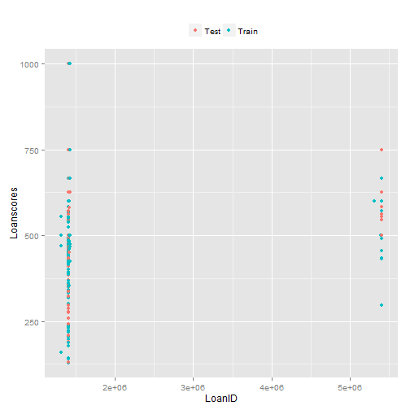
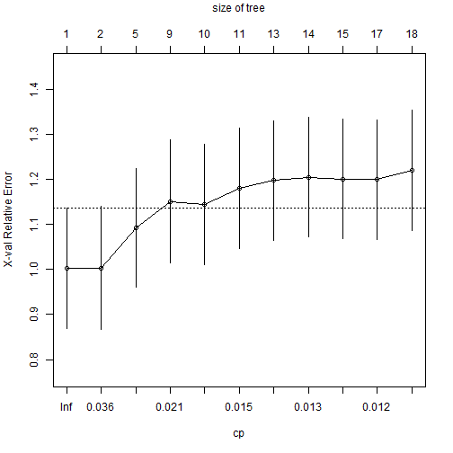
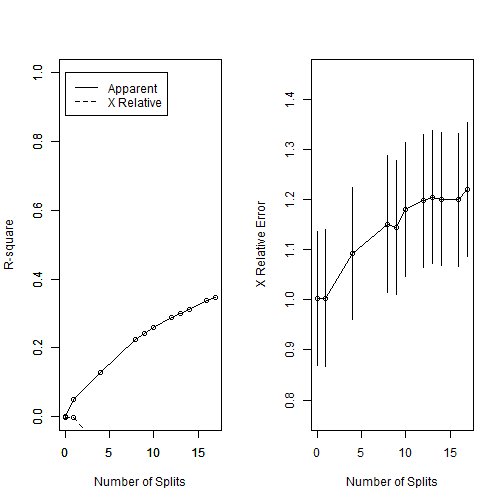
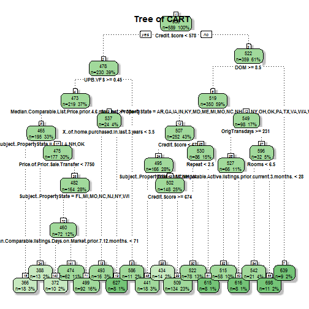
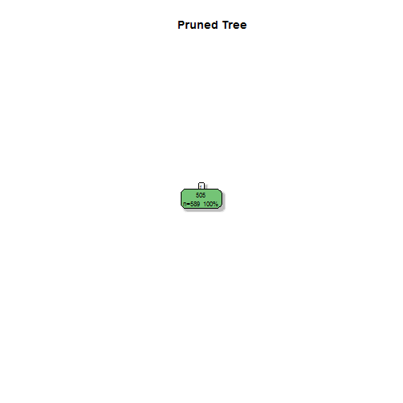
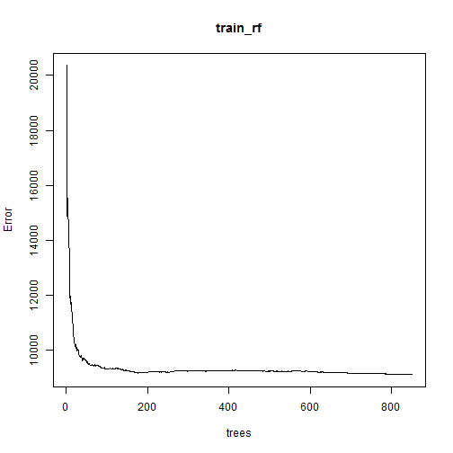
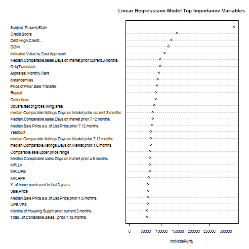
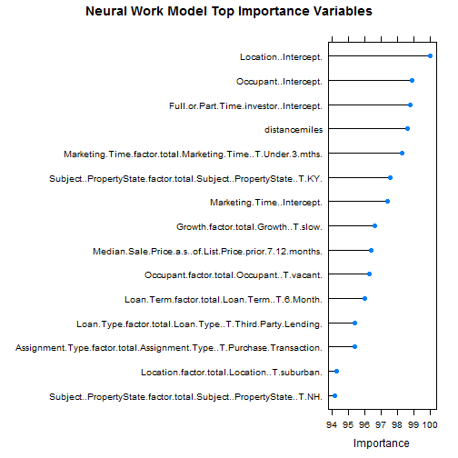
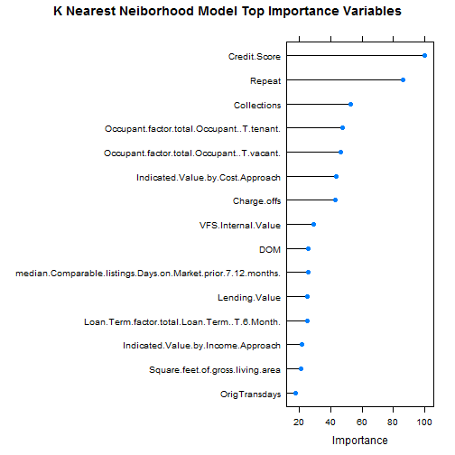
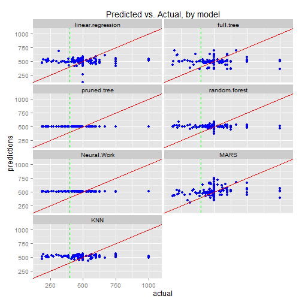

Regression Model-Treebased
=================================================================
##Treebased method for predictive modelling


### Basic Settings  

```r
echo = TRUE
setwd("c:/Users/jasmine.qi/Documents/regression")

library(ggplot2)
library(lattice)
library(caret)
library(rpart)
library(rpart.plot)
library(miscTools)
library(rattle)
library(RSNNS)
library(nnet)
library(neuralnet)
library(MARSS)
library(earth)
library(tidyr)
library(e1071)
library(Rcmdr)
library(randomForest)
```


```r
total= read.csv("Derivedata.csv")
total=total[!(is.na(total$Classifier)),]

##randomsize 70% of row of data as training set and test set
#set.seed(15)

indexes = sample(1:nrow(total), size= 0.7*nrow(total))
train = total[indexes, ]
test = total[-indexes, ]

nrow(train)
```

```
## [1] 589
```

```r
nrow(test)
```

```
## [1] 253
```

```r
## plot train and test dataset

group <- rep(NA,842)
group <- ifelse(seq(1,842) %in% indexes,"Train","Test")
df <- data.frame(LoanID=total$LoanID,Loanscores=total$Loanscore)

# ...and plot it
ggplot(df,aes(x = LoanID,y = Loanscores, color = group)) + geom_point() +
  scale_color_discrete(name="") + theme(legend.position="top")
```

 

## Non Tree-based Model

```r
##Multilinear regression

  formula=Loanscore ~ Absorption.Rate...prior.4.6.months. + 
  Absorption.Rate...prior.7.12.months. + 
  Absorption.Rate...prior.current.3.months. + Appraisal.Monthly.Rent + 
  Appraisal.price + Assignment.Type + Bankrupcy + Baths + Bedrooms + 
  Borrower.Age.Group + Borrower.Rent + Built.up + Charge.offs + 
  Closed.Past.Auto.Late + Closed.Past.Education.Late + 
  Closed.Past.Installment.Late + Closed.Past.Mortgage.Late + 
  Closed.Revolving.Late + Collections + Comparable.properties.lower.price + 
  Comparable.properties.upper.price + Comparable.sale.lower.price.range + 
  Comparable.sale.upper.price.range + Condition + Credit.Score  + 
  Current.Rent + Debt.High.Credit.... + Demand.Supply + 
  distancemiles + DOM + Expected.cost.to.Rehab63 + Expected.flip.price + 
  Foreclosure + Foreclosure.sales + 
  Full.or.Part.Time.investor + Growth + Indicated.Value.by.Cost.Approach + 
  Indicated.Value.by.Income.Approach + Interest.Rate + Lending.Value + 
  Loan.Purpose + Loan.Term + Loan.Type + Location + LTV + Male.Female + 
  Marketing.Time + Median.Comparable.List.Price.prior.4.6.months. + 
  Median.Comparable.List.Price.prior.7.12.months. + 
  Median.Comparable.List.Price.prior.current.3.months. + 
  median.Comparable.listings.Days.on.Market.prior.4.6.months. + 
  median.Comparable.listings.Days.on.Market.prior.7.12.months. + 
  median.Comparable.listings.Days.on.Market.prior.current.3.months. + 
  Median.Comparable.Sale.Price..prior.4.6.months. + 
  Median.Comparable.Sale.Price..prior.7.12.months. + 
  Median.Comparable.Sale.Price..prior.current.3.months. + 
  Median.Comparable.sales.Days.on.market.prior.4.6.months. + 
  Median.Comparable.sales.Days.on.market.prior.7.12.months. + 
  Median.Comparable.sales.Days.on.market.prior.current.3.months. + 
  Median.Sale.Price.a.s..of.List.Price.prior.4.6.months. + 
  Median.Sale.Price.a.s..of.List.Price.prior.7.12.months. + 
  Median.Sale.Price.a.s..of.List.Price.prior.current.3.months. + 
  Months.of.Housing.Supply.prior.4.6.months. + 
  Months.of.Housing.Supply.prior.7.12.months. + 
  Months.of.Housing.Supply.prior.current.3.months. + Occupant + 
  Open.Current.Auto.Late + Open.Current.Education.Late + 
  Open.Current.Installment.Late + Open.Current.Mortgage.Late + 
  Open.Current.Revolving.Late  + Origination.UPB + 
  OrigTransdays + Price.of.Prior.Sale.Transfer+ 
  Property.Values + Rent.Own + Repeat + Rooms + Sale.Price + Size + 
  Square.feet.of.gross.living.area  + 
  Subject..PropertyState + Total...of.Comarable.Sales...prior.4.6.months. + 
  Total...of.Comarable.Sales...prior.7.12.months. + 
  Total...of.Comarable.Sales...prior.current.3.months. + 
  Total...of.Comparable.Active.listings.prior.4.6.months. + 
  Total...of.Comparable.Active.listings.prior.7.12.months. + 
  Total...of.Comparable.Active.listings.prior.current.3.months. + Type + 
  Units + VFS.Internal.Value + WLV + X..of.comarable.properties + 
  X..of.comparable.sales + X..of.home.purchased.in.last.3.years + 
  X..of.Properties.currently.owned + X..of.years.investing +Yearbuilt+MR.UPB+MR.LV +MR.VFS+MR.APP+MR.MCSP+LV.VFS+APP.VFS+UPB.VFS
```

##New LM model after stepwise

```r
linreg = lm(formula, data=train)

#summary(linreg)
```


```r
summary(linreg.new)
```

```
## 
## Call:
## lm(formula = Loanscore ~ Absorption.Rate...prior.current.3.months. + 
##     Bankrupcy + Bedrooms + Collections + Comparable.properties.lower.price + 
##     Debt.High.Credit.... + Expected.flip.price + Indicated.Value.by.Cost.Approach + 
##     Median.Comparable.sales.Days.on.market.prior.7.12.months. + 
##     Median.Comparable.sales.Days.on.market.prior.current.3.months. + 
##     Months.of.Housing.Supply.prior.4.6.months. + Occupant + Open.Current.Revolving.Late + 
##     Origination.UPB + Repeat + Total...of.Comarable.Sales...prior.7.12.months. + 
##     Total...of.Comparable.Active.listings.prior.current.3.months. + 
##     VFS.Internal.Value, data = train)
## 
## Residuals:
##     Min      1Q  Median      3Q     Max 
## -314.86  -31.00    0.55   30.05  484.40 
## 
## Coefficients:
##                                                                  Estimate
## (Intercept)                                                     4.747e+02
## Absorption.Rate...prior.current.3.months.                      -2.564e+00
## Bankrupcy[T.Y]                                                 -3.155e+01
## Bedrooms                                                        1.208e+01
## Collections                                                    -3.097e+00
## Comparable.properties.lower.price                               1.086e-04
## Debt.High.Credit....                                           -6.975e+00
## Expected.flip.price                                             9.391e-05
## Indicated.Value.by.Cost.Approach                               -2.035e-04
## Median.Comparable.sales.Days.on.market.prior.7.12.months.      -6.457e-02
## Median.Comparable.sales.Days.on.market.prior.current.3.months.  1.063e-01
## Months.of.Housing.Supply.prior.4.6.months.                     -4.917e-02
## Occupant[T.tenant]                                             -1.022e+01
## Occupant[T.vacant]                                              1.969e+01
## Open.Current.Revolving.Late[T.Y]                               -2.101e+01
## Origination.UPB                                                -5.035e-04
## Repeat                                                          7.615e+00
## Total...of.Comarable.Sales...prior.7.12.months.                 8.391e-01
## Total...of.Comparable.Active.listings.prior.current.3.months.   1.262e-01
## VFS.Internal.Value                                              3.564e-04
##                                                                Std. Error
## (Intercept)                                                     2.355e+01
## Absorption.Rate...prior.current.3.months.                       1.614e+00
## Bankrupcy[T.Y]                                                  1.456e+01
## Bedrooms                                                        4.770e+00
## Collections                                                     1.053e+00
## Comparable.properties.lower.price                               7.215e-05
## Debt.High.Credit....                                            1.924e+00
## Expected.flip.price                                             4.765e-05
## Indicated.Value.by.Cost.Approach                                1.019e-04
## Median.Comparable.sales.Days.on.market.prior.7.12.months.       3.087e-02
## Median.Comparable.sales.Days.on.market.prior.current.3.months.  4.582e-02
## Months.of.Housing.Supply.prior.4.6.months.                      1.763e-02
## Occupant[T.tenant]                                              1.833e+01
## Occupant[T.vacant]                                              1.829e+01
## Open.Current.Revolving.Late[T.Y]                                9.790e+00
## Origination.UPB                                                 3.356e-04
## Repeat                                                          2.485e+00
## Total...of.Comarable.Sales...prior.7.12.months.                 3.435e-01
## Total...of.Comparable.Active.listings.prior.current.3.months.   7.857e-02
## VFS.Internal.Value                                              1.938e-04
##                                                                t value
## (Intercept)                                                     20.156
## Absorption.Rate...prior.current.3.months.                       -1.588
## Bankrupcy[T.Y]                                                  -2.168
## Bedrooms                                                         2.532
## Collections                                                     -2.941
## Comparable.properties.lower.price                                1.505
## Debt.High.Credit....                                            -3.625
## Expected.flip.price                                              1.971
## Indicated.Value.by.Cost.Approach                                -1.996
## Median.Comparable.sales.Days.on.market.prior.7.12.months.       -2.092
## Median.Comparable.sales.Days.on.market.prior.current.3.months.   2.319
## Months.of.Housing.Supply.prior.4.6.months.                      -2.789
## Occupant[T.tenant]                                              -0.557
## Occupant[T.vacant]                                               1.077
## Open.Current.Revolving.Late[T.Y]                                -2.146
## Origination.UPB                                                 -1.500
## Repeat                                                           3.065
## Total...of.Comarable.Sales...prior.7.12.months.                  2.443
## Total...of.Comparable.Active.listings.prior.current.3.months.    1.606
## VFS.Internal.Value                                               1.839
##                                                                Pr(>|t|)
## (Intercept)                                                     < 2e-16
## Absorption.Rate...prior.current.3.months.                      0.112812
## Bankrupcy[T.Y]                                                 0.030597
## Bedrooms                                                       0.011606
## Collections                                                    0.003403
## Comparable.properties.lower.price                              0.132822
## Debt.High.Credit....                                           0.000315
## Expected.flip.price                                            0.049235
## Indicated.Value.by.Cost.Approach                               0.046408
## Median.Comparable.sales.Days.on.market.prior.7.12.months.      0.036903
## Median.Comparable.sales.Days.on.market.prior.current.3.months. 0.020741
## Months.of.Housing.Supply.prior.4.6.months.                     0.005458
## Occupant[T.tenant]                                             0.577583
## Occupant[T.vacant]                                             0.282057
## Open.Current.Revolving.Late[T.Y]                               0.032325
## Origination.UPB                                                0.134194
## Repeat                                                         0.002280
## Total...of.Comarable.Sales...prior.7.12.months.                0.014884
## Total...of.Comparable.Active.listings.prior.current.3.months.  0.108805
## VFS.Internal.Value                                             0.066419
##                                                                   
## (Intercept)                                                    ***
## Absorption.Rate...prior.current.3.months.                         
## Bankrupcy[T.Y]                                                 *  
## Bedrooms                                                       *  
## Collections                                                    ** 
## Comparable.properties.lower.price                                 
## Debt.High.Credit....                                           ***
## Expected.flip.price                                            *  
## Indicated.Value.by.Cost.Approach                               *  
## Median.Comparable.sales.Days.on.market.prior.7.12.months.      *  
## Median.Comparable.sales.Days.on.market.prior.current.3.months. *  
## Months.of.Housing.Supply.prior.4.6.months.                     ** 
## Occupant[T.tenant]                                                
## Occupant[T.vacant]                                                
## Open.Current.Revolving.Late[T.Y]                               *  
## Origination.UPB                                                   
## Repeat                                                         ** 
## Total...of.Comarable.Sales...prior.7.12.months.                *  
## Total...of.Comparable.Active.listings.prior.current.3.months.     
## VFS.Internal.Value                                             .  
## ---
## Signif. codes:  0 '***' 0.001 '**' 0.01 '*' 0.05 '.' 0.1 ' ' 1
## 
## Residual standard error: 91.19 on 569 degrees of freedom
## Multiple R-squared:  0.1452,	Adjusted R-squared:  0.1167 
## F-statistic: 5.089 on 19 and 569 DF,  p-value: 2.59e-11
```

```r
#Apply LM model to test data 

test_pred_lm = predict(linreg.new, newdata=test)

# Evaluate the accuracy
RMSE_linreg = sqrt(mean(test_pred_lm-test$Loanscore)^2)
RMSE_linreg
```

```
## [1] 22.98114
```

```r
MAE_linreg = mean(abs(test_pred_lm-test$Loanscore))
MAE_linreg
```

```
## [1] 99.64589
```

## Set Tree based methods

```r
##grow tree
train_tree = rpart(formula, data= train)

train_tree$cptable
```

```
##            CP nsplit rel error   xerror      xstd
## 1  0.04883740      0 1.0000000 1.002316 0.1334283
## 2  0.02660865      1 0.9511626 1.003322 0.1367872
## 3  0.02381167      4 0.8713367 1.092320 0.1318924
## 4  0.01901784      8 0.7760900 1.150842 0.1371095
## 5  0.01741693      9 0.7570722 1.143708 0.1334579
## 6  0.01357786     10 0.7396552 1.179408 0.1338285
## 7  0.01305460     12 0.7124995 1.197177 0.1329257
## 8  0.01261183     13 0.6994449 1.204337 0.1328458
## 9  0.01179519     14 0.6868331 1.200861 0.1327818
## 10 0.01128357     16 0.6632427 1.199374 0.1328499
## 11 0.01000000     17 0.6519591 1.219818 0.1331557
```

```r
plotcp(train_tree)
```

 

```r
## create additional plots 

par(mfrow=c(1,2))
rsq.rpart(train_tree)
```

```
## 
## Regression tree:
## rpart(formula = formula, data = train)
## 
## Variables actually used in tree construction:
##  [1] Credit.Score                                                 
##  [2] DOM                                                          
##  [3] Median.Comparable.List.Price.prior.4.6.months.               
##  [4] median.Comparable.listings.Days.on.Market.prior.7.12.months. 
##  [5] OrigTransdays                                                
##  [6] Price.of.Prior.Sale.Transfer                                 
##  [7] Repeat                                                       
##  [8] Rooms                                                        
##  [9] Subject..PropertyState                                       
## [10] Total...of.Comparable.Active.listings.prior.current.3.months.
## [11] UPB.VFS                                                      
## [12] X..of.home.purchased.in.last.3.years                         
## 
## Root node error: 5535158/589 = 9397.6
## 
## n= 589 
## 
##          CP nsplit rel error xerror    xstd
## 1  0.048837      0   1.00000 1.0023 0.13343
## 2  0.026609      1   0.95116 1.0033 0.13679
## 3  0.023812      4   0.87134 1.0923 0.13189
## 4  0.019018      8   0.77609 1.1508 0.13711
## 5  0.017417      9   0.75707 1.1437 0.13346
## 6  0.013578     10   0.73966 1.1794 0.13383
## 7  0.013055     12   0.71250 1.1972 0.13293
## 8  0.012612     13   0.69944 1.2043 0.13285
## 9  0.011795     14   0.68683 1.2009 0.13278
## 10 0.011284     16   0.66324 1.1994 0.13285
## 11 0.010000     17   0.65196 1.2198 0.13316
```

 


```r
##plot tree of trainig model

fancyRpartPlot(train_tree, cex=0.7,main= "Tree of CART ", sub="" )
```

 


```r
##predict using decision Tree

test_pred = predict(train_tree, newdata= test)

##check performance of tree model
train_tree_r2=rSquared(test$Loanscore, test$Loanscore-test_pred)
MSE_tree = mean(test$Loanscore - test_pred)
train_tree_r2
```

```
##           [,1]
## [1,] -0.172456
```

```r
MSE_tree
```

```
## [1] 3.684515
```

```r
RMSE_tree = sqrt(mean(test_pred-test$Loanscore)^2)
RMSE_tree
```

```
## [1] 3.684515
```

```r
MAE_tree = mean(abs(test_pred-test$Loanscore))
MAE_tree
```

```
## [1] 76.59974
```
###prune the tree


```r
opt = train_tree$cptable[which.min(train_tree$cptable[, "xerror"]),1]
ptrain_tree = prune(train_tree, cp=opt)


fancyRpartPlot(ptrain_tree, cex=0.7,main= "Pruned Tree", sub="" )
```

 

```r
#predict using pruning tree

ptest_pred=predict(ptrain_tree, test)

RMSE_ptree = sqrt(mean(ptest_pred-test$Loanscore)^2)
RMSE_ptree
```

```
## [1] 5.050365
```

```r
MAE_ptree =mean(abs(ptest_pred-test$Loanscore))
MAE_ptree
```

```
## [1] 58.47311
```
###Random Forest method


```r
#set.seed(15)

train_rf=randomForest(formula, data=train, na.action=na.omit, ntree=850,mtry=8, proximity=T)
train_rf
```

```
## 
## Call:
##  randomForest(formula = formula, data = train, ntree = 850, mtry = 8,      proximity = T, na.action = na.omit) 
##                Type of random forest: regression
##                      Number of trees: 850
## No. of variables tried at each split: 8
## 
##           Mean of squared residuals: 9120.082
##                     % Var explained: 2.95
```

```r
plot(train_rf)
```

 

```r
##importance of each variables
imp =as.data.frame(sort(importance(train_rf)[,1],decreasing = TRUE),optional = T)
names(imp) = "%Inc MSE"

imp
```

```
##                                                                     %Inc MSE
## Subject..PropertyState                                            326331.949
## Credit.Score                                                      147661.924
## Debt.High.Credit....                                              131079.733
## DOM                                                               120979.887
## Indicated.Value.by.Cost.Approach                                  108692.942
## Median.Comparable.sales.Days.on.market.prior.current.3.months.     95767.792
## OrigTransdays                                                      94805.319
## Appraisal.Monthly.Rent                                             92041.205
## distancemiles                                                      86704.585
## Price.of.Prior.Sale.Transfer                                       86426.657
## Repeat                                                             81343.662
## Collections                                                        81299.807
## Square.feet.of.gross.living.area                                   77355.702
## median.Comparable.listings.Days.on.Market.prior.current.3.months.  72531.342
## Median.Comparable.sales.Days.on.market.prior.7.12.months.          72309.534
## Median.Sale.Price.a.s..of.List.Price.prior.7.12.months.            69036.557
## Yearbuilt                                                          66299.263
## median.Comparable.listings.Days.on.Market.prior.7.12.months.       66262.983
## median.Comparable.listings.Days.on.Market.prior.4.6.months.        65639.270
## Comparable.sale.upper.price.range                                  63033.513
## Median.Comparable.sales.Days.on.market.prior.4.6.months.           62860.746
## MR.LV                                                              62485.447
## MR.UPB                                                             62440.393
## MR.APP                                                             59700.607
## X..of.home.purchased.in.last.3.years                               57569.859
## Sale.Price                                                         57383.583
## Median.Sale.Price.a.s..of.List.Price.prior.4.6.months.             57096.026
## UPB.VFS                                                            56688.181
## Months.of.Housing.Supply.prior.current.3.months.                   55796.213
## Total...of.Comarable.Sales...prior.7.12.months.                    55712.831
## Total...of.Comparable.Active.listings.prior.current.3.months.      55647.660
## X..of.comparable.sales                                             54857.713
## Months.of.Housing.Supply.prior.4.6.months.                         53649.108
## APP.VFS                                                            53117.201
## MR.VFS                                                             52903.448
## Charge.offs                                                        52824.704
## X..of.comarable.properties                                         52326.706
## Expected.flip.price                                                51667.338
## Occupant                                                           51184.059
## Comparable.properties.lower.price                                  51159.811
## Median.Comparable.List.Price.prior.7.12.months.                    50141.595
## Comparable.properties.upper.price                                  49763.519
## Origination.UPB                                                    49577.159
## Appraisal.price                                                    49027.722
## Total...of.Comparable.Active.listings.prior.4.6.months.            48027.933
## WLV                                                                48014.047
## Borrower.Age.Group                                                 47763.563
## Absorption.Rate...prior.7.12.months.                               47721.258
## Size                                                               47455.401
## Median.Comparable.Sale.Price..prior.4.6.months.                    46232.865
## LV.VFS                                                             46074.504
## Months.of.Housing.Supply.prior.7.12.months.                        45609.127
## Median.Comparable.Sale.Price..prior.current.3.months.              45390.680
## Lending.Value                                                      44762.930
## Total...of.Comparable.Active.listings.prior.7.12.months.           44222.638
## Absorption.Rate...prior.4.6.months.                                44037.660
## Median.Sale.Price.a.s..of.List.Price.prior.current.3.months.       43865.672
## Total...of.Comarable.Sales...prior.4.6.months.                     43582.179
## Comparable.sale.lower.price.range                                  43023.089
## Interest.Rate                                                      42984.878
## X..of.years.investing                                              42930.153
## Indicated.Value.by.Income.Approach                                 42776.721
## Median.Comparable.Sale.Price..prior.7.12.months.                   41916.443
## Median.Comparable.List.Price.prior.4.6.months.                     41829.648
## Median.Comparable.List.Price.prior.current.3.months.               41715.104
## LTV                                                                41434.874
## Condition                                                          40653.767
## X..of.Properties.currently.owned                                   38023.920
## MR.MCSP                                                            37895.197
## VFS.Internal.Value                                                 36968.114
## Rooms                                                              35786.696
## Bedrooms                                                           35425.511
## Borrower.Rent                                                      35199.286
## Absorption.Rate...prior.current.3.months.                          33507.194
## Loan.Term                                                          32669.859
## Total...of.Comarable.Sales...prior.current.3.months.               32407.600
## Baths                                                              27731.344
## Property.Values                                                    22195.395
## Demand.Supply                                                      21596.577
## Expected.cost.to.Rehab63                                           18018.926
## Marketing.Time                                                     17764.293
## Open.Current.Installment.Late                                      16714.521
## Location                                                           14165.571
## Assignment.Type                                                    14017.899
## Foreclosure.sales                                                  12793.092
## Closed.Past.Installment.Late                                       11514.234
## Full.or.Part.Time.investor                                         10916.734
## Open.Current.Revolving.Late                                        10142.151
## Closed.Past.Auto.Late                                               9961.459
## Current.Rent                                                        9802.548
## Type                                                                9716.489
## Bankrupcy                                                           9556.424
## Open.Current.Mortgage.Late                                          8162.924
## Rent.Own                                                            7846.300
## Foreclosure                                                         6849.718
## Built.up                                                            6445.090
## Loan.Purpose                                                        6322.515
## Open.Current.Auto.Late                                              6128.678
## Units                                                               5929.149
## Male.Female                                                         5119.724
## Closed.Revolving.Late                                               5118.969
## Open.Current.Education.Late                                         4401.772
## Growth                                                              2810.137
## Closed.Past.Mortgage.Late                                           2467.355
## Closed.Past.Education.Late                                          2197.672
## Loan.Type                                                           1620.011
```

```r
## prediction test data
test_pred3= predict(train_rf, newdata=test)

## R^2 and MSE
train_r2= rSquared(test$Loanscore, test$Loanscore-test_pred3)
train_r2
```

```
##           [,1]
## [1,] 0.1098518
```

```r
MSE = mean(test$Loanscore - test_pred3)
MSE
```

```
## [1] 4.37986
```

```r
RMSE_rf= sqrt(mean(test_pred3-test$Loanscore)^2)
RMSE_rf
```

```
## [1] 4.37986
```

```r
MAE_rf = mean(abs(test_pred3-test$Loanscore))
MAE_rf
```

```
## [1] 58.21739
```

```r
##plot importance variables
varImpPlot(train_rf, cex=0.7, main="Linear Regresssion Model Top Importance Variables")
```

 

## Other Regression Model

### Load Clean Data

```r
total= read.csv("datawocolin.csv") #read data file which has transformed, and encoding categrecals
#encoding  N = -1 Y = 1  
total$LoanID=NULL
total$X = NULL

dim(total)
```

```
## [1] 842 145
```

```r
indexes = sample(1:nrow(total), size= 0.7*nrow(total))

train = total[indexes, ]
dim(train)
```

```
## [1] 589 145
```

```r
myvars =names(train) %in% "Loanscore"
trainX= train[!myvars]
trainY =train$Loanscore#        

test = total[-indexes, ]
myvarsTest = names(test) %in% "Loanscore"
testX= test[!myvarsTest]
testY = test$Loanscore
```

###NW

```r
nnetTune = train(trainX, trainY,
                  method = "nnet",
                trainControl=trainControl(method="cv"),
                  linout = TRUE,
                  trace = FALSE)
```

```
## Warning in nominalTrainWorkflow(x = x, y = y, wts = weights, info =
## trainInfo, : There were missing values in resampled performance measures.
```

```r
plot(varImp(nnetTune), top=15, main="Neural Work Model Top Importance Variables")
```

 

```r
test_nnet = predict(nnetTune, test)

RMSE_nnet=sqrt(mean(test_nnet-test$Loanscore)^2)
RMSE_nnet
```

```
## [1] 7.662483
```

```r
MAE_nnet=mean(abs(test_nnet-test$Loanscore))
MAE_nnet
```

```
## [1] 53.87867
```
###MARS 


```r
train_mars = earth(trainX, trainY)
train_mars
```

```
## Selected 20 of 33 terms, and 17 of 144 predictors
## Termination condition: RSq changed by less than 0.001 at 33 terms
## Importance: Repeat, Credit.Score, Bedrooms, ...
## Number of terms at each degree of interaction: 1 19 (additive model)
## GCV 8955.355    RSS 4599312    GRSq 0.1697391    RSq 0.2735841
```

```r
test_mars=predict(train_mars, test)

RMSE_mars=sqrt(mean(test_mars-test$Loanscore)^2)
RMSE_mars
```

```
## [1] 10.38739
```

```r
MAE_mars=mean(abs(test_mars-test$Loanscore))
MAE_mars
```

```
## [1] 70.93069
```


###kNN

```r
# Remove a few sparse and unbalanced fingerprints first
knnDescr = trainX[, -nearZeroVar(trainX)] 
knnTune = train(knnDescr,
                trainY,
                method = "knn",
                tuneGrid = data.frame(.k = 1:20),
                trControl = trainControl(method = "cv"))

plot(varImp(knnTune), top=15, main="K Nearest Neiborhood Model Top Importance Variables")
```

 

```r
test_knn=predict.train(knnTune, testX[, -nearZeroVar(trainX)])

RMSE_knn=sqrt(mean(test_knn-test$Loanscore)^2)
RMSE_knn
```

```
## [1] 11.04739
```

```r
MAE_knn=mean(abs(test_knn-test$Loanscore))
MAE_knn
```

```
## [1] 63.20591
```


##Comparison of performance of models


```r
##Accuracy 
accuracy = data.frame(Method = c("Linear Regression","Full tree","Pruned tree","Random forest", "Neural Work", "MARS", "KNN"),
                         RMSE   = c(RMSE_linreg,RMSE_tree,RMSE_ptree,RMSE_rf, RMSE_nnet, RMSE_mars, RMSE_knn),
                         MAE    = c(MAE_linreg,MAE_tree,MAE_ptree,MAE_rf, MAE_nnet, MAE_mars, MAE_knn)) 

# Round it
accuracy$RMSE = round(accuracy$RMSE, 4)
accuracy$MAE = round(accuracy$MAE, 4)

accuracy
```

```
##              Method    RMSE     MAE
## 1 Linear Regression 22.9811 99.6459
## 2         Full tree  3.6845 76.5997
## 3       Pruned tree  5.0504 58.4731
## 4     Random forest  4.3799 58.2174
## 5       Neural Work  7.6625 53.8787
## 6              MARS 10.3874 70.9307
## 7               KNN 11.0474 63.2059
```

```r
# predictions comparison

predictions_comp = data.frame(actual = test$Loanscore,
                              linear.regression = test_pred_lm,
                              full.tree = test_pred,
                              pruned.tree = ptest_pred,
                              random.forest = test_pred3,
                              Neural.Work = test_nnet, 
                              MARS= test_mars,
                              KNN = test_knn)

colnames(predictions_comp)=c("actual", "linear.regression", " full.tree ", "pruned.tree", "random.forest", "Neural.Work", "MARS","KNN")
head(predictions_comp)
```

```
##      actual linear.regression  full.tree  pruned.tree random.forest
## 2  500.0000          489.6330    509.0209    504.9739      496.4486
## 4  500.0000          431.9465    509.0209    504.9739      371.2605
## 7  468.7500          530.4437    514.8385    504.9739      519.3411
## 10 500.0000          560.2455    492.6362    504.9739      525.1353
## 11 525.0000          528.4870    542.0738    504.9739      509.7043
## 14 423.0769          565.6563    474.3808    504.9739      515.3097
##    Neural.Work     MARS      KNN
## 2     502.1686 372.0708 482.4728
## 4     513.2809 440.7682 508.4761
## 7     513.2809 561.7417 550.6250
## 10    502.1686 575.4218 477.7305
## 11    502.1686 722.3473 519.2073
## 14    513.2809 535.4848 532.3016
```

```r
#reshape dataset


all.predictions = gather(predictions_comp,key = model,value = predictions,2:8)

head(all.predictions)
```

```
##     actual             model predictions
## 1 500.0000 linear.regression    489.6330
## 2 500.0000 linear.regression    431.9465
## 3 468.7500 linear.regression    530.4437
## 4 500.0000 linear.regression    560.2455
## 5 525.0000 linear.regression    528.4870
## 6 423.0769 linear.regression    565.6563
```

```r
tail(all.predictions)
```

```
##        actual model predictions
## 1766 600.0000   KNN    518.2457
## 1767 500.0000   KNN    542.9275
## 1768 555.5556   KNN    521.7842
## 1769 500.0000   KNN    523.7906
## 1770 500.0000   KNN    527.7778
## 1771 500.0000   KNN    523.7906
```

```r
#plot performence of prediciton model with actual data

ggplot(data = all.predictions,aes(x = actual, y = predictions)) + 
  geom_point(colour = "blue") + 
  geom_abline(intercept = 0, slope = 1, colour = "red") +
  geom_vline(xintercept = 400, colour = "green", linetype = "dashed") +
  facet_wrap(~ model,ncol = 2) + 
  coord_cartesian(xlim = c(120,1100),ylim = c(120,1100)) +
  ggtitle("Predicted vs. Actual, by model")
```

 
